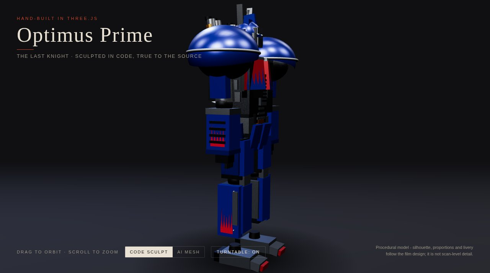

# Optimus Prime - sculpted in code

A hand-built procedural Three.js model of Optimus Prime as he appears in The Last Knight.



**Live:** https://aeiouvcode.github.io/optimus-prime/

## About

Every plate of the code sculpt is generated from geometry in `main.js`; there are no scans. The silhouette, proportions and livery follow the film design, though it is not scan-level detail. A second view loads an AI-generated mesh for comparison. Drag to orbit, scroll to zoom, and toggle the turntable.

Optimus Prime and Transformers are trademarks of Hasbro. This is an unofficial fan study and is not affiliated with or endorsed by Hasbro or Paramount.

## Built with

Three.js (vendored, with OrbitControls, GLTFLoader and RoomEnvironment), no build step.

## Run locally

```sh
git clone https://github.com/aeiouvcode/optimus-prime.git
cd optimus-prime
python3 -m http.server 8000
```

Then open http://localhost:8000.

## Layout

```
index.html   page shell
main.js      procedural model, scene and UI
styles.css   styles
ai-mesh/     comparison mesh, split into parts with a manifest
vendor/      Three.js and addons
docs/        README assets
```
